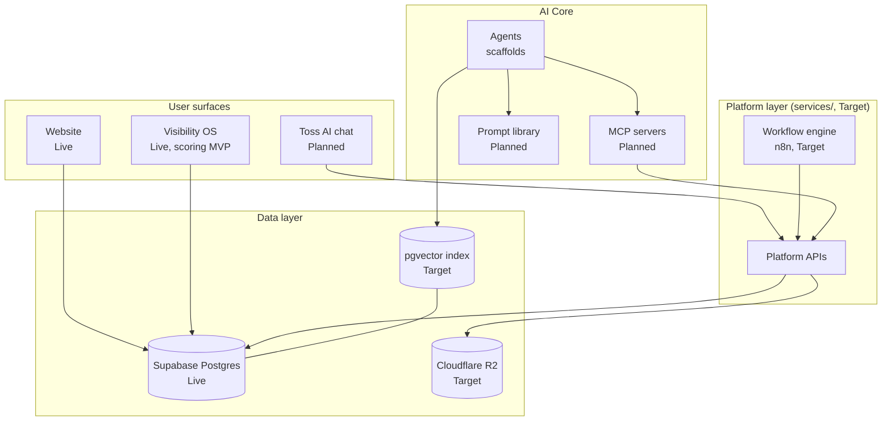

# 01. System Overview

This blueprint owns the target system architecture of the AI Growth Operating System. The verified current state is owned by [docs/01-architecture/system-overview.md](../docs/01-architecture/system-overview.md); anything here not marked Live is Target and needs an ADR before implementation.

## Target topology

## Evolution path

| Capability | Current | Target |
|---|---|---|
| User surfaces | Website, Visibility OS (Vercel) | plus Toss AI chat assistant |
| Backend | Route handlers inside each app | plus standalone platform APIs in `services/` |
| Automation | None (Clerk webhook only) | n8n workflow engine, [05-workflow-engine.md](05-workflow-engine.md) |
| Knowledge | `docs/` for humans | plus machine layer with pgvector, [04-knowledge-brain.md](04-knowledge-brain.md) |
| Storage | Postgres only | plus Cloudflare R2 for objects |
| AI models | Anthropic Claude (ADR-0006) | multi-model, needs superseding ADR |

## Rules that do not change

Apps deploy independently; agents are headless; buy over build for undifferentiated parts; everything documented. These are owned by [docs/01-architecture/system-overview.md](../docs/01-architecture/system-overview.md).
