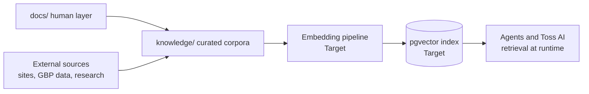

# 04. Knowledge Brain

This blueprint owns the knowledge architecture: how knowledge is stored for humans, made usable by machines, and kept from rotting. The rules of the human layer are owned by [docs/README.md](../docs/README.md).

## Two layers

| Layer | Home | Consumers | Status |
|---|---|---|---|
| Human knowledge | `docs/` (decisions, standards, SOPs, strategy) | People and coding assistants | Live |
| Machine knowledge | `knowledge/` (curated corpora, datasets, source lists) | Agents, retrieval pipelines | Planned |

## Target flow

The embedding pipeline and pgvector index are Target and need an ADR (see [07-database-architecture.md](07-database-architecture.md)).

## Promotion paths (how knowledge moves)

1. `research/` finding that becomes a decision graduates to an ADR.
2. ADR or lesson that becomes standing knowledge graduates to the owning doc in `docs/`.
3. Doc content an agent needs at runtime is curated into `knowledge/`, referencing the source doc. One home per fact still holds: `knowledge/` entries cite their owning doc, they do not fork it.

## Anti-rot rules

Docs ship with the change (AGENTS.md). A `knowledge/` corpus that cites a changed doc is stale and must be regenerated; the embedding pipeline must be re-runnable from scratch for exactly this reason.
