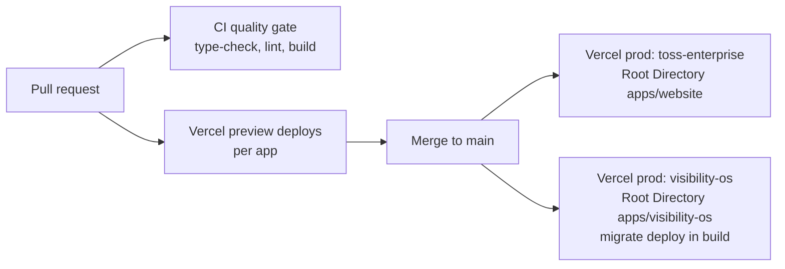

# 10. Deployment Architecture

This blueprint owns the deployment topology: what deploys where, how changes reach production, and where that is heading. The deploy SOP is owned by [docs/05-operations/deployment.md](../docs/05-operations/deployment.md); the hosting decision is [ADR-0002](../docs/01-architecture/decisions/0002-nextjs-app-router-on-vercel.md).

## Current topology

- Two Vercel projects, one per app, each with its Root Directory set to the app folder (a project building a pnpm monorepo from the repo root fails Next.js detection; lesson recorded).
- The Vercel git integration owns deploys; CI is a pure quality gate, currently blocked by the GitHub Actions billing lock (annotation: account locked due to a billing issue).
- Database migrations apply during the Visibility OS build ([07-database-architecture.md](07-database-architecture.md)).

## Target additions

| Piece | Deployment story | Gate |
|---|---|---|
| `services/` APIs | Undecided: Vercel functions versus a Node host | ADR when the first service lands |
| Agents | Headless Node workers; scheduler and host undecided | ADR before first runtime agent |
| Workflow engine (n8n) | Hosting undecided (managed versus self-hosted) | Same ADR as the n8n adoption |
| `infrastructure/` | Provider setup and IaC once anything exists outside Vercel plus Supabase | Build when first needed |
| `deployment/` | Environment definitions and release checklists as code | Build when first needed |

## Rules

1. `vercel.json` changes require preview-deploy verification before merge (breakage history).
2. Anything that deploys gets a row here and a doc in `docs/05-operations/` in the same change.
