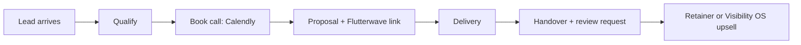

# Business Operating System (BOS)

This document owns how Toss Enterprise makes money and how work flows from lead to cash. The AI Operating System ([../03-ai/ai-operating-system.md](../03-ai/ai-operating-system.md)) automates the steps defined here; it never redefines them.

## Revenue streams

| Stream | Vehicle | Pricing rail | Status |
|---|---|---|---|
| Website and automation builds | apps/website services pages | Flutterwave one-time payment | Live |
| Growth retainers | Retainer builder on website | Flutterwave recurring by agreement | Live |
| Digital products (e.g. Lux Catalog, Julie Luxury Spa) | Website products page | Flutterwave | Live per work page |
| Visibility OS subscriptions | apps/visibility-os | FREE plan in schema; paid tiers TBD | In development |

## The client lifecycle

1. **Lead arrives**: WhatsApp (+234 808 791 9951), website contact form (Supabase), or referral.
2. **Qualify**: is the budget and scope real? The sales agent will own this step when built ([../03-ai/agents/sales-agent.md](../03-ai/agents/sales-agent.md)).
3. **Book**: Calendly link, see `apps/website/lib/config.ts` for the canonical URL.
4. **Proposal and payment**: scope in writing, Flutterwave payment link before work starts. No unpaid starts.
5. **Delivery**: per SOP [../05-operations/sops/client-onboarding.md](../05-operations/sops/client-onboarding.md).
6. **Handover**: credentials transferred, review requested, case study captured for the work page.
7. **Expand**: retainer or Visibility OS subscription.

## Operating metrics (track weekly)

- Leads by channel, calls booked, proposals sent, close rate.
- Active retainers and MRR equivalent.
- Visibility OS signups and activated businesses (once launched).
- Delivery cycle time from payment to handover.

No dashboard exists yet; metrics live in the operator's tracking until Phase 2 of [../implementation-phases.md](../implementation-phases.md) adds instrumentation.

## Rules

- Payment before delivery, always through Flutterwave links, never personal accounts.
- Every engagement gets a written scope, even a one-line WhatsApp confirmation counts only after it is copied into the client record.
- Every delivered project becomes a portfolio entry on the website work page.

## Open questions

- Formal client records location (currently ad hoc; candidate: `clients/` folder per [../01-architecture/monorepo.md](../01-architecture/monorepo.md), or a CRM).
- Retainer contract template.
