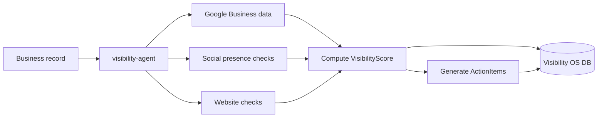

# Data Architecture

This document owns where data lives, who owns each store, and the rules for access. Schema details live with the owning app; this doc is the registry.

## Data stores

| Store | Technology | Owner | Contents | Access path |
|---|---|---|---|---|
| Website DB | Supabase (Postgres) | `apps/website` | Contact form submissions, notify-me signups | Supabase JS client, anon key, `apps/website/lib/supabase.ts` |
| Visibility OS DB | Postgres via Prisma | `apps/visibility-os` | Users, Businesses, VisibilityScores, ActionItems | Prisma client, `apps/visibility-os/lib/db.ts`, schema at `apps/visibility-os/prisma/schema.prisma` |
| Auth records | Clerk (external SaaS) | Clerk | Identities, sessions | Clerk SDK; mirrored into Visibility OS `User` via Svix webhook at `app/api/webhooks/clerk/route.ts` |

## Ownership rules

1. **One writer per store.** Only the owning app's code defines and migrates its schema. Agents that need Visibility OS data use the same Prisma schema package as the app; they never run their own migrations.
2. **No cross-database joins.** If website data and Visibility OS data must meet, they meet in application code or a future shared warehouse, never by pointing two apps at one database.
3. **Migrations are code.** Prisma migrations are committed and run through the deploy pipeline, never hand-applied in production. (Current gap: no migration files are committed yet, only the schema. Phase 1 item.)
4. **PII discipline.** Client contact data (emails, phone numbers) is PII. It stays in the owning store, never gets copied into docs, logs, prompts, or fixtures.

## Visibility OS core model (summary)

`User` (mirrors Clerk, has `plan`: FREE default) owns `Business` (NG-default country, Google Place ID, socials) which has many `VisibilityScore` (total plus google/social/website subscores, review count, rating; append-only time series) and `ActionItem` (the recommendations engine output). The authoritative definition is the Prisma schema; read it before touching the model.

## The scoring pipeline (target)

The scoring formula is a product decision and is owned by [../04-product/visibility-os.md](../04-product/visibility-os.md).

## Open questions

- Backup and retention policy for both stores. Nothing is configured today.

## Resolved

- The Visibility OS Postgres is a **Supabase instance provisioned through the Vercel integration** (confirmed 2026-07-06 from the project's env set). Prisma reads `POSTGRES_PRISMA_URL` (pooled) and `POSTGRES_URL_NON_POOLING` (non-pooling, migrations). Baseline migration committed; `prisma migrate deploy` runs in the Vercel build (ADR-0007).
