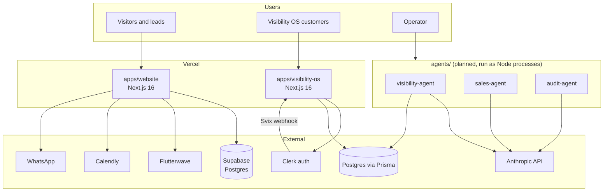

# System Overview

This document owns the top-level architecture of Toss Enterprise: what systems exist, how they connect, and the honest current state. Detail lives in the sibling docs; decisions live in [decisions/](decisions/).

## System context

## Components

| Component | Package | Status | Doc |
|---|---|---|---|
| Marketing site | `@toss/website` | Live on Vercel | [../04-product/website.md](../04-product/website.md) |
| Visibility OS | `@toss/visibility-os` | In development, Phase 1 deployed | [../04-product/visibility-os.md](../04-product/visibility-os.md) |
| Visibility agent | `@toss/visibility-agent` | Planned (manifest only, no source) | [../03-ai/agents/visibility-agent.md](../03-ai/agents/visibility-agent.md) |
| Sales agent | `@toss/sales-agent` | Planned (manifest only, no source) | [../03-ai/agents/sales-agent.md](../03-ai/agents/sales-agent.md) |
| Audit agent | `@toss/audit-agent` | Planned (manifest only, no source) | [../03-ai/agents/audit-agent.md](../03-ai/agents/audit-agent.md) |
| Shared packages | `packages/*` | Planned, none exist yet | [monorepo.md](monorepo.md) |

## Architectural principles

1. **Apps deploy independently.** One Vercel project per app; no app imports from another app, only from `packages/`.
2. **Agents are headless workers.** They never serve HTTP to end users; they read and write the same databases the apps own, through the owning app's contracts. See [data-architecture.md](data-architecture.md).
3. **Buy over build for undifferentiated parts.** Auth (Clerk), payments (Flutterwave), booking (Calendly), email (Resend planned).
4. **Everything documented.** New components require a row in the table above, a product or agent doc, and an ADR if a technology choice was made.

## Honest current state (as of 2026-07-05)

- `apps/website` is live and is the only app wired into root scripts and CI.
- `apps/visibility-os` builds and deploys but its Vercel config history shows fragility (multiple fix commits); treat deploy config as sensitive.
- `agents/*` contain only `package.json`; running workspace-wide builds will fail on them.
- No `packages/` exist despite the workspace glob allowing them.
- No tests anywhere. No monitoring. CI's pnpm frozen-lockfile install cannot pass because only `package-lock.json` is committed.

All of these are scheduled in [../implementation-phases.md](../implementation-phases.md) Phase 0 and 1. Do not fix them ad hoc without following the phase plan.
