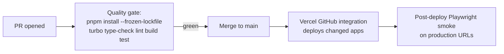

# CI/CD

This document owns the pipeline. The workflow file is `.github/workflows/ci.yml`. Deployment procedures for humans are in [../05-operations/deployment.md](../05-operations/deployment.md).

## Current pipeline (honest state)

On push to `main` (and `develop`) and PRs to `main`:

1. `ci` job: pnpm install (frozen lockfile), type-check, lint, build (with Supabase public env vars from secrets).
2. `deploy-website` job (main only): `npx vercel --prod` with the website project ID.

### Known defects (Phase 0 fixes, do not work around silently)

1. **The frozen-lockfile install cannot pass**: only `package-lock.json` is committed; `pnpm-lock.yaml` does not exist. Production deploys currently succeed only because the Vercel GitHub integration deploys independently of this workflow.
2. **Double deploy path**: both the Vercel GitHub integration and the CI deploy job target production. One must be chosen (target: keep the GitHub integration, delete the CI deploy job, keep CI as a pure quality gate).
3. **Root scripts route to apps/website only**, so "type-check" and "lint" in CI never check visibility-os or agents.
4. **`develop` trigger** references a branch with no role.

## Target pipeline

- CI is a quality gate only; Vercel owns deployment.
- Turbo runs tasks across all workspace packages, with remote caching if build times warrant it.
- Post-deploy smoke tests page the operator on failure (see [../05-operations/monitoring.md](../05-operations/monitoring.md)).

## Secrets in CI

GitHub Actions secrets currently referenced: `NEXT_PUBLIC_SUPABASE_URL`, `NEXT_PUBLIC_SUPABASE_ANON_KEY`, `VERCEL_TOKEN`, `VERCEL_ORG_ID`, `VERCEL_PROJECT_ID_WEBSITE`. The Vercel ones become removable once the CI deploy job is deleted. Registry: [environments-and-secrets.md](environments-and-secrets.md).
