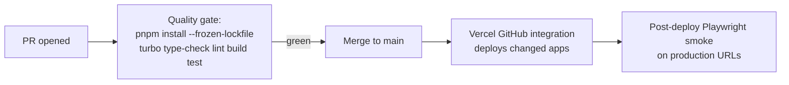

# CI/CD

This document owns the pipeline. The workflow file is `.github/workflows/ci.yml`. Deployment procedures for humans are in [../05-operations/deployment.md](../05-operations/deployment.md).

## Current pipeline

On push and PRs to `main`, a single **Quality Gate** job runs: pnpm install (frozen lockfile, pnpm version read from the `packageManager` field, Node from `.nvmrc`), then turbo `type-check`, `lint`, and `build` across every workspace package. Supabase public env vars come from repo secrets for the website build.

CI does not deploy. The Vercel GitHub integration owns deployment exclusively (the old CI deploy job and the dead `develop` trigger were removed in Phase 0).

## Target pipeline

- CI is a quality gate only; Vercel owns deployment.
- Turbo runs tasks across all workspace packages, with remote caching if build times warrant it.
- Post-deploy smoke tests page the operator on failure (see [../05-operations/monitoring.md](../05-operations/monitoring.md)).

## Secrets in CI

GitHub Actions secrets referenced by the workflow: `NEXT_PUBLIC_SUPABASE_URL` and `NEXT_PUBLIC_SUPABASE_ANON_KEY` (website build). The old `VERCEL_TOKEN`, `VERCEL_ORG_ID`, and `VERCEL_PROJECT_ID_WEBSITE` secrets are no longer used by any workflow and can be deleted from the repo settings. Registry: [environments-and-secrets.md](environments-and-secrets.md).
