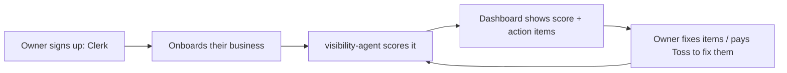

# Product: Visibility OS

- **Package:** `@toss/visibility-os` at `apps/visibility-os`
- **Status:** In development. Phase 1 (auth, onboarding, dashboard shell, data model) is built and deployed. Scoring is not implemented; that is the visibility-agent's job.
- **Job:** show a local business owner exactly how visible they are online and exactly what to do next, on a subscription.

## The core loop (target)

The product is the loop, not the dashboard. The dashboard only renders the loop's state.

## What exists today (verified against code)

- Clerk sign-in/sign-up, onboarding form, dashboard shell with score card component, businesses page, settings page.
- API: businesses CRUD route, Clerk webhook (user mirror).
- Data model in Prisma: User (plan: FREE default), Business, VisibilityScore (append-only), ActionItem. See [../01-architecture/data-architecture.md](../01-architecture/data-architecture.md).
- Runs on port 3001 locally.

## What does not exist yet

- Any real score (no agent, no scoring formula).
- Paid plans: the `Plan` enum has FREE; paid tiers, limits, and Flutterwave billing are undecided (open question in vision-and-strategy.md and ADR-0004).
- Committed Prisma migrations (schema only): baseline migration is a Phase 1 blocker.
- Emails of any kind.

## Product decisions pending (each blocks specific work)

| Decision | Blocks |
|---|---|
| Scoring formula and weights | visibility-agent implementation |
| Plan tiers, limits, pricing | billing work, re-score cadence |
| Score cadence per tier | agent scheduling |
| NG-only vs multi-country at launch | Google data source choice, copy |

## Success metrics (once live)

Signups, businesses onboarded, weekly active owners, action items completed, free-to-paid conversion.
