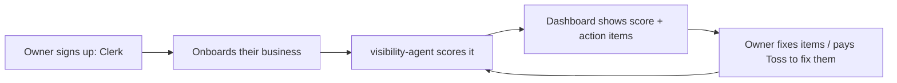

# Product: Visibility OS

- **Package:** `@toss/visibility-os` at `apps/visibility-os`
- **Status:** In development. Phase 1 (auth, onboarding, dashboard shell, data model) is built and deployed. Scoring is not implemented; that is the visibility-agent's job.
- **Job:** show a local business owner exactly how visible they are online and exactly what to do next, on a subscription.

## The core loop (target)

The product is the loop, not the dashboard. The dashboard only renders the loop's state.

## What exists today (verified against code, updated 2026-07-06)

- Clerk sign-in/sign-up, onboarding, dashboard, businesses page, settings page.
- **Scoring v1 (live):** deterministic audit in `lib/scoring.ts`, no external API keys. Website checks (reachable, HTTPS, title, meta description, mobile viewport, response time), Google presence (profile URL, phone, category, city), social presence (Instagram handle). Weights: Google 40%, website 40%, social 20%. Runs automatically after onboarding and on demand via the dashboard audit buttons (`POST /api/businesses/[id]/score`).
- **Action items (live):** every failed check generates a plain-language recommendation with priority (HIGH/MEDIUM/LOW) and category; open PENDING items are regenerated on each audit, IN_PROGRESS and DONE are preserved.
- API: businesses CRUD (Zod-validated), score route, Clerk webhook handler (Svix-verified; secret not yet configured in prod, lazy user-upsert covers creation).
- Data: Supabase Postgres via the Vercel integration (`POSTGRES_PRISMA_URL` / `POSTGRES_URL_NON_POOLING`), committed baseline migration, `prisma migrate deploy` in the Vercel build. See [ADR-0007](../01-architecture/decisions/0007-supabase-postgres-and-in-app-scoring-v1.md).
- Runs on port 3001 locally.

## What does not exist yet

- Live Google data (reviews, ratings): `googleScore` v1 measures profile completeness; `reviewCount`/`avgRating` stay 0 until the visibility-agent lands (Phase 2).
- Scheduled re-scoring (audits are user-triggered today).
- Paid plans: the `Plan` enum has FREE; paid tiers, limits, and Flutterwave billing are undecided.
- Emails of any kind. Action item status toggling in the UI.

## Product decisions pending (each blocks specific work)

| Decision | Blocks |
|---|---|
| Google data source and cost ceiling | visibility-agent (live reviews/ratings) |
| Plan tiers, limits, pricing | billing work, re-score cadence |
| Score cadence per tier | agent scheduling |
| NG-only vs multi-country at launch | Google data source choice, copy |

## Success metrics (once live)

Signups, businesses onboarded, weekly active owners, action items completed, free-to-paid conversion.
